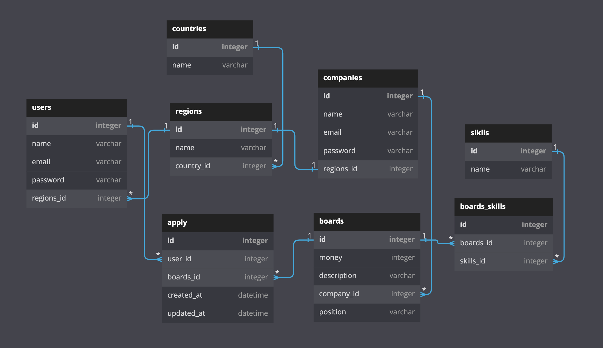

## ✅ wanted_pre_onboarding

요구사항
- 유저는 채용공고에 지원을 한다.
- 기업은 채용공고를 등록한다.
- 채용공고의 일부 사항을 변경한다.
- 채용공고를 삭제한다.
- 채용공고에서 원하는 내용을 search 한다.

<br>
<br>

## ✅ 개발 인원
- Back-end  : 김도연

<br>
<br>

## ✅ 개발 기간
- 2022.10.16 ~ 2022.10.18 (3일)

<br>
<br>

## ✅ DB 모델링
- 모델링


<br>
<br>

## ✅ Directory 구조
```
.
├── __pycache__
├── boards
├── companies
├── core
├── users
└── wanted
 
```
<br>
<br>

## ✅ 백엔드 역할
- 김도연
  - 유저 회원가입 API, 로그인 API
  - 유저 지원리스트 API
  - 회사 회원가입 API, 로그인 API
  - 회사 채용등록리스트 API
  - 채용공고 전체리스트 API
  - 채용공고 회사의등록 API
  - 채용공고(상세) 유저지원 API
  - 채용공고(상세) 정보출력 API
  - 채용공고(상세) 정보수정 API
  - 채용공고(상세) 정보삭제 API

  
<br>
<br>

## ✅ 백엔드 기술 스택
  - Back-end : Python, Django, JWT, Miniconda 
  - Database : dbdiagram.io, MySQL
  - HTTP     : Postman
  - Common   : Git & Github, notion
    
<br>
<br>

## ✅ API명세서
- 주소 : https://www.notion.so/wanted-API-9f4d7d9c5cc7411989c06010a4c66246


<br>
<br>

## ✅ Postman
- 주소 : https://documenter.getpostman.com/view/22269789/2s847EQDPc