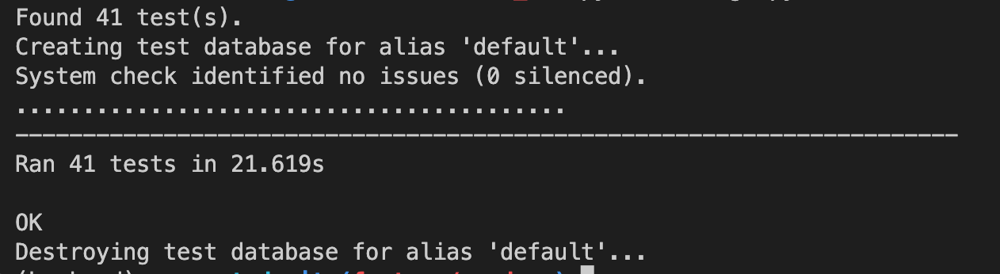

## ✅ wanted_pre_onboarding

요구사항
- 유저는 채용공고에 지원을 한다.
- 기업은 채용공고를 등록한다.
- 채용공고의 일부 사항을 변경한다.
- 채용공고를 삭제한다.
- 채용공고에서 원하는 내용을 search 한다.

<br>
<br>

## ✅ 개발 인원
- Back-end  : 김도연

<br>
<br>

## ✅ 개발 기간
- 2022.10.16 ~ 2022.10.18 (3일)

<br>
<br>

## ✅ DB 모델링
- 모델링


### 주요 관계

이번 프로젝트에서 가장 중요한 관계 
- 유저(User)와 채용공고(Board)
- 회사(Company)와 채용공고(Board)의 관계이다.

<u>유저는 채용공고에 지원(Apply)할 수 있다.
회사는 채용공고를 등록(Post)할 수 있다.</u>

회사와 채용공고 사이에는 1:M의 관계가 성립힌다.
하나의 회사객체는 직무별, 내용별로 다양한 채용공고객체를 작성하고 가질 수 있다.
하나의 채용공고객체는 하나의 회사객체만을 가져야 한다.

유저와 채용공고 사이에는 M:N의 관계가 성립한다.
한명의 유저는 여러개의 채용공고에 지원할 수 있기 때문에 다수의 채용공고 객체를 가질 수 있다.
하나의 채용공고객체는 여러사람에게서 지원을 받기 때문에 다수의 유저 객체를 가질 수 있다.

유저와 채용공고 사이에는 중간테이블이 필요하고, 중간테이블 역할로서 apply테이블이 있다. 어느 유저가 어떤 채용공고에 지원했는지 각각의 id를 가지고서 나타낸다.

<br>

### 그외 관계
국가(countries)와 지역(regions) 의 관계는 1:N의 관계이다.
<br>하나의 국가객체는 여러개의 지역객체를 가질 수 있다.<br>
(한국은 서울,부산,제주도,강원도 등 여러 지역객체를 가질 수 있다.)

지역(regions)와 유저(user), 지역(regions)와 회사(companies)의 관계는 1:N의 관계이다.
유저와 회사는 하나의 지역만을 가질 수 있고, 하나의 지역객체는 다수의 회사, 유저 객체를 가질 수 있다.

스킬(Skills)와 채용공고(boards)의 관계는 M:N의 관계이다.
하나의 채용공고는 여러개의 스킬을 적을수 있고, 하나의 스킬은 여러개의 채용공고에 적힐 수 있다.
M:N의 관계를 해소하기 위해서 중간에 boards_skills테이블을 만들었다.


<br>
<br>

## ✅ Directory 구조
```
.
├── __pycache__
├── boards
├── companies
├── core
├── users
└── wanted
 
```
<br>
<br>

## ✅ 백엔드 역할
- 김도연
  - 유저 회원가입 API, 로그인 API
  - 유저 지원리스트 API
  - 회사 회원가입 API, 로그인 API
  - 회사 채용등록리스트 API
  - 로그인 데코레이터
  - 채용공고 전체리스트 API
  - 채용공고 회사의등록 API
  - 채용공고(상세) 유저지원 API
  - 채용공고(상세) 정보출력 API
  - 채용공고(상세) 정보수정 API
  - 채용공고(상세) 정보삭제 API

<br>
유저, 회사 회원가입 API

- http의 post메서드에 해당하며, body를 통해서 회원가입에 필요한 데이터를 받음
- 회사의 경우 name을 유니크한 속성으로 만들어서 중복확인
- 유저의 경우 email을 유니크한 속성으로 만들어서 중복확인
- password는 bcrypt 모듈을 이용, 전달받은 데이터를 gensalt(), hashpw()를 이용해서 Rainbow table Attack을 방지 
- hashpw에 해당하는 패스워드를 DB에 저장

<br>
유저, 회사 로그인 API

- bcrypt의 checkpw()를 이용 전달받은 패스워드와 DB의 패스워드가 같은지 확인
- 로그인 성공 시 jwt를 이용, 토큰을 발급
- jwt로 각각, 유저id, 회사id를 payload에 담아 알고리즘과 시크릿키를 이용 encode 후 전달

<br>
로그인 데코레이터

- 로그인시 발급된 jwt토큰을 jwt모듈을 이용해서 payload에 담기 정보를 추출
- 데코레이터를 이용해 로그인이 필요한 서비스에 대해 인가

<br>
지원리스트, 채용공고리스트 API

- 데코레이터로 유저와 회사의 id를 payload로 부터 추출 후 filter를 이용해서 해당 지원, 채용공고데이터 출력

<br>
채용공고 전체리스트 API

- ORM의 객체 all()을 이용해서 전체 데이터를 추출
- 쿼리스트링을 이용해 search에 해당하는 데이터를 유저가 입력
- filter와 Q()를 이용해서 search에 해당하는 객체 데이터 추출
- distinct()로 중복된 객체 제거


<br>
채용공고 회사의등록 API

- 데코레이터를 이용 인가
- skills은 리스트 형태로 입력
- board객체 생성 후 skills객체 add()
- @transaction.atomic()을 board객체에 skill의 add()에 대한 transaction의 원자성 유지

<br>
채용공고(상세) 유저지원 API

- path파라미터로 채용공고를 특정
- 데코레이터를 이용 유저 특정
- Apply객체 생성
- apply, created = get_or_create()로 해당 유저의 지원이력유무 분기 처리
- 지원이력이 없다면 새로운 객체 생성
- 지원이력이 있다면 create(flag)가 False

<br>
채용공고(상세) 정보출력 API

- path 파라미터로 채용공고 특정
- Board.objects.select_related('company').prefetch_related('skills').get(id = board_id)
- select_related와 prefetch_related를 활용 ORM 최적화
- select_related()로 정참조에 대한 최적화
- prefetch_rekated()로 역참조에 대한 최적화 

<br>
채용공고(상세) 정보수정 API

- path 파라미터로 채용공고 특정, 데코레이터를 이용 등록 회사 인가
- update_or_create() id를 이용해서 존재하는 객체인지 여부 확인
- default 값을 이용해서 변경되지 않을 경우에 원본 객체의 데이터 그대로 사용

<br>
채용공고(상세) 정보삭제 API

- path 파라미터로 채용공고 특정, 데코레이터를 이용 등록 회사 인가
- 해당 채용공고 삭제

<br>
<br>

## ✅ 백엔드 기술 스택
  - Back-end : Python, Django, JWT, Miniconda 
  - Database : dbdiagram.io, MySQL
  - HTTP     : Postman
  - Common   : Git & Github, notion
    
<br>
<br>

## ✅ API명세서
- 주소 : https://www.notion.so/wanted-API-9f4d7d9c5cc7411989c06010a4c66246


<br>
<br>

## ✅ Postman
- 주소 : https://documenter.getpostman.com/view/22269789/2s847EQDPc

<br>
<br>

## ✅ UnitTest


